# Automating Azure DevOps
Implementing DevOps in your organisation can  sometime require automating some of these  DevOps processes. For code management or CI/CD pipeline.

Examples are:
- Automatically creating branches,  forking repositories, updating files  in a repo in response  to an event in a program or a user action
-  Triggering CI/CD pipeline execution to automatically provision environment e.g. sandbox, devtest
- Acting in response to ADO events such as pipeline execution or work item events via ADO event hooks

The easiest way to interact with ADO is via its rich set of APIs. REST APIs calls are what the ADO website uses whenever you interact  with the ADO portal in your web browser.

How you call the APIs is up to you and there are many options available. Writing custom code is probably an option if you are writing complexe logic but the easiest way is to leverage Azure services such as Logic Apps or Azure Function. Logic Apps has an out of the box connector that makes integration easy. This is this approach that is presented in this article.

##  What API do I use?
### 1 - Search the ADO APIs documention
https://docs.microsoft.com/en-us/rest/api/azure/devops/?view=azure-devops-rest-6.1

Select the version of the API in the drop down list :
5.0 or 6.0 

### 2 - Look-up the URL in your web browser
- Go to ADO project in your web browser
- Open the developer tool console and choose Network
- Navigate ADO site and take actions and see the URLs that are used for each  of these actions

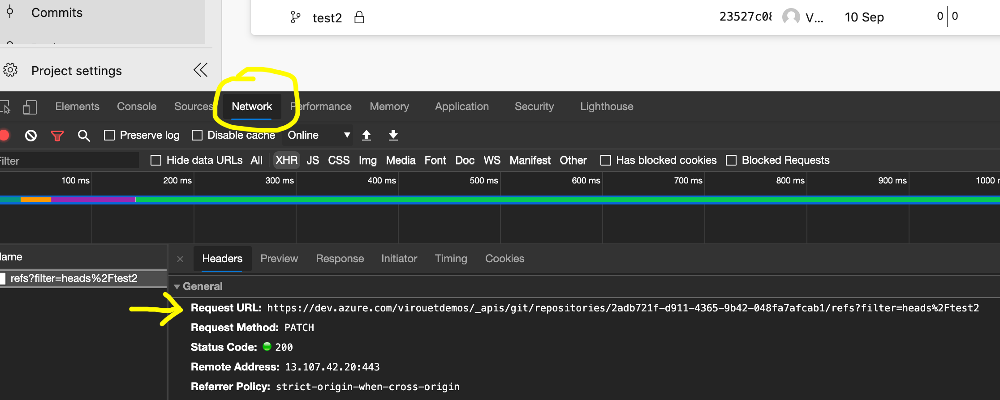
In this example, I locked the test2 branch and the URL shown was called. It indicates the syntx to use if you want to lock a branch.

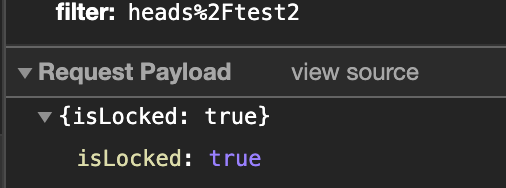

Scroll down to see the payload (json body) that need to be passed. In this case {isLocked: true}

# Automate ADO with Logic Apps
Logic App has an ADO Connector. See the documentation here https://docs.microsoft.com/en-us/connectors/visualstudioteamservices/


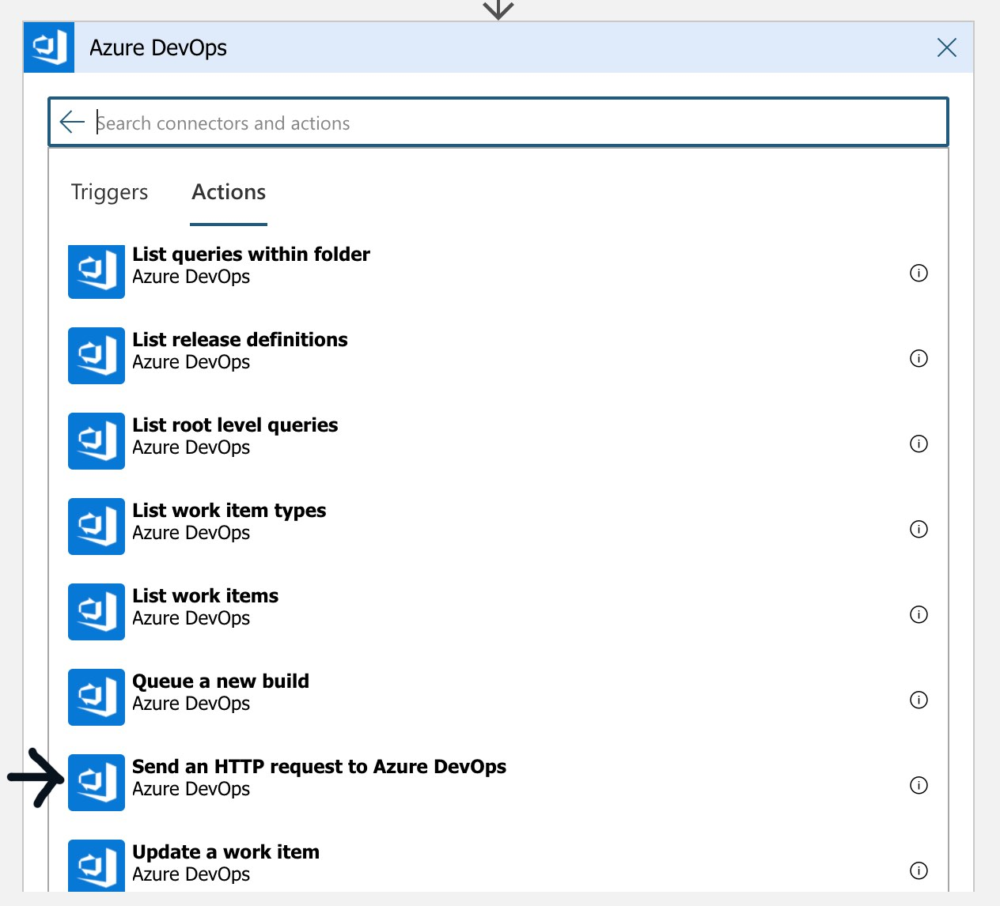

You can select most common actions from the drop down list  but the most flexible way to use it is to  use the 'Send an HTTP request to Azure DevOps'. It allows you to specify the URL, header and body that you want to send to ADO.
See the examples further down.

## Get Project IDs

- In your Logic App select the Azure DevOps activity.
- select the 'Send an HTTP request to Azure DevOps'.
- specify the org name
- add the Relative URI
``` 
_apis/projects?api-version=6.0 
```

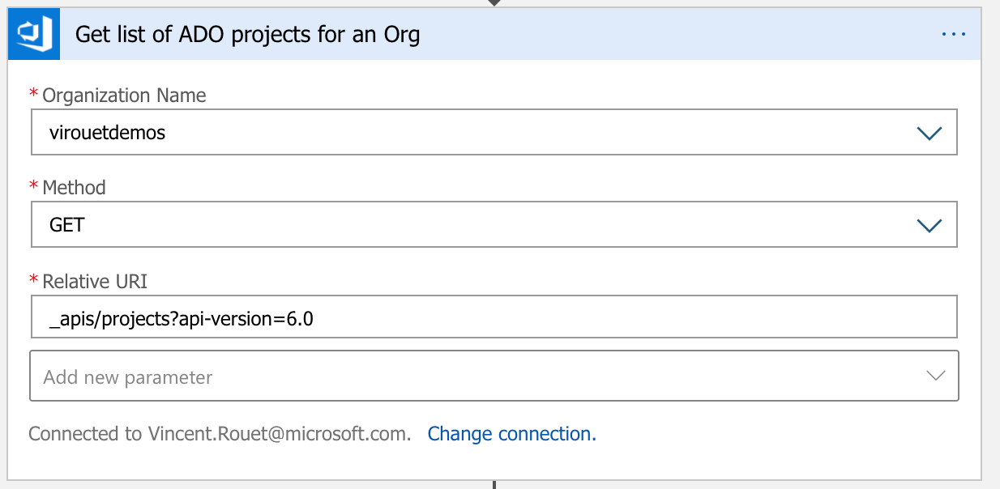

- Once you've pulled all the project from the organisation you can filter to get id for the project you are looking for. Either filter directly using code syntax or use first a Parse Json to  parse the ouput from the ADO http get project ids call

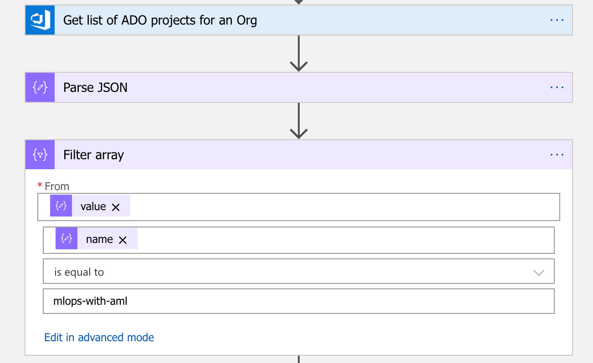

You then get the project details to  extract the id you need.

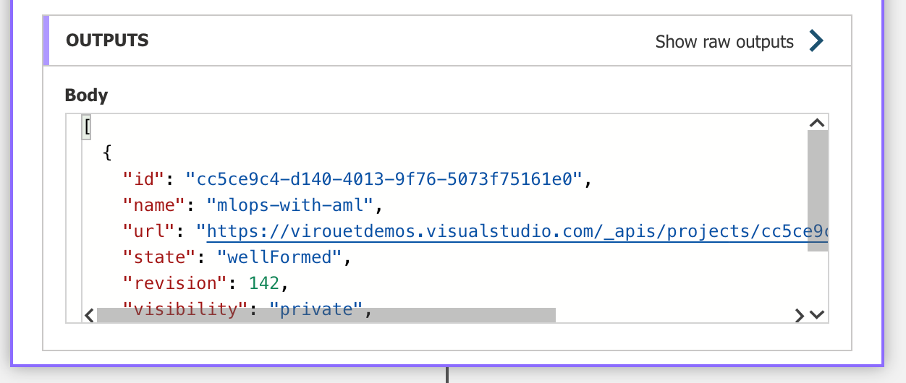

## Get project  details
You can get the specific details of a project, instead of a list, using this uri:

Method: GET

Relative URI:
``` 
_apis/projects/{project-name}?api-version=6.0 
```
## Get Repositories IDs
Method: GET

Relative URI: 
``` 
{project-name}/_apis/git/repositories?api-version=6.0 
```

## Fork a repo
Method: POST

Relative URI: 
```
 _apis/git/repositories?api-version=6.0
 ```

Body:
```
{
  "name":"[{name-of-new-repo(destination)}",
    "parentRepository":
    {
    "id":"{id of origin repo}",
    "project":{
    "id":"{id of project for the origin repo}"}
    },
    "project":{"id":"{id of destination project for new repo}"}
    }
  }
}
```


## Lock a branch
- In your Logic App select the Azure DevOps activity.
- select the 'Send an HTTP request to Azure DevOps'.
- Select the organisation from the drop down list (or specify it dynamically using custom value)
- Select Method PATCH
- Add the parameter Body and add the value: 'true' to lock and 'false' to unlock.
``` 
{isLocked: true}
```


- create the Relative URI completing with the following  information

``` 
_apis/git/repositories/{repositoryid}/refs?filter=heads%2F{branch-name}&api-version=5.0 
```

- add the content-type = application/json

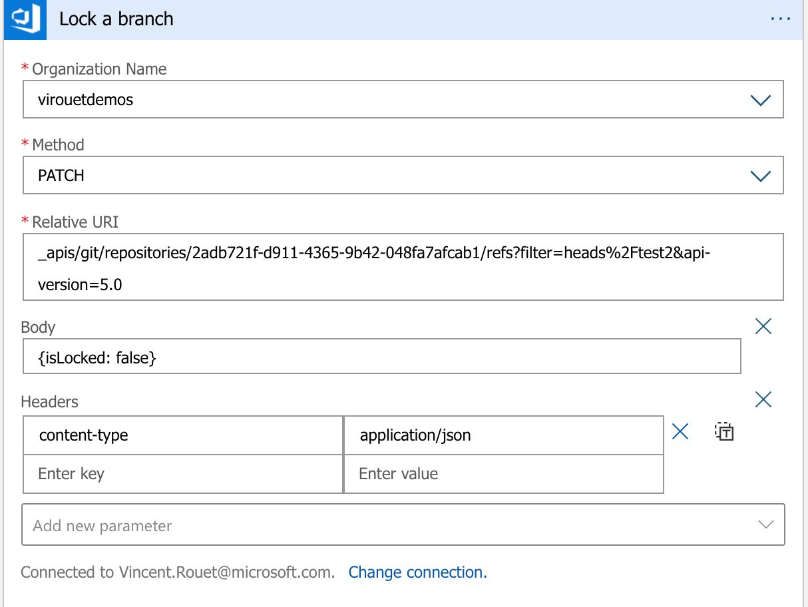

Example to unlock branch 'test2'

## Create a pipeline
Method: POST

Relative URI: 
```
{project-name}/_apis/pipelines?api-version=6.0-preview
```

Body:
```
{
  "name": "{destinationRepositoryName}",
  "folder": "\\",
  "configuration": {
    "path": "{path to yaml file in code repo}",
    "repository": {
      "id": "{destination repo id}",
      "name": "{destination repo name}",
      "type": "azureReposGit"
    },
    "type": "yaml",
    "triggers": {
      "settingsSourceType": 2,
      "triggerType": 2
    }
  }
}
```
## Trigger a pipeline

Triggering a pipeline means you will need to check for completion. One approach is to start a build and then check for status until a none "In-progress" status is found.

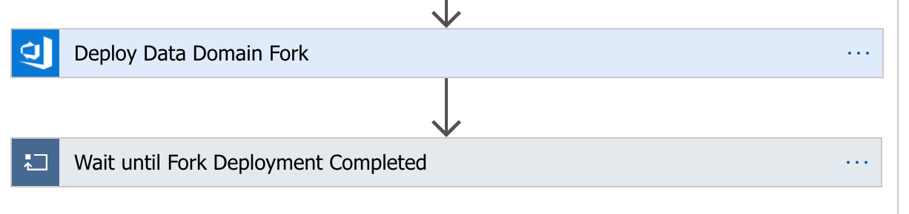

Trigger the pipeline: Use the default connector action 'Queue a new build'

- Organization name: name  of your ADO organisation from the drop down list (or custom value)

- Project Name: provide the name of your project

- Build Definition Id: select the name of the pipeline or provide a custom value. 

... or per the screenshot below, use dynamic values

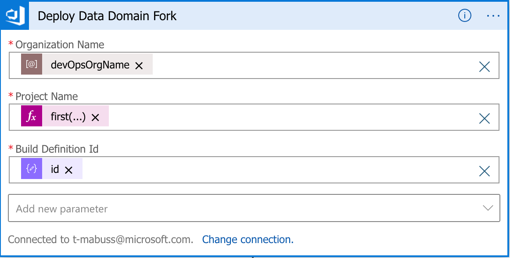

To check  for completed execution use a 'Wait until" and 'Delay' shapes. This checks until the status is different than 'inProgress'

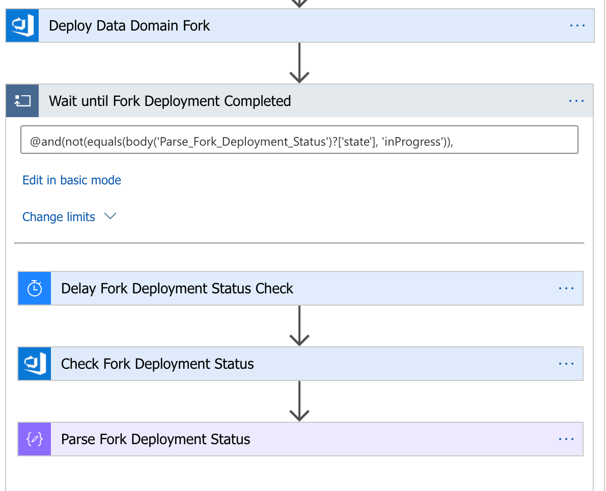


## Use ADO Service hooks with Logic Apps

ADO Service hooks allow you to trigger a process on ADO events. You can easily integrate Logic App with ADO Service hooks by using Azure storage or Service bus. This example below uses Sb but can work in a similar way with a storage queue.
This solution is an asynchonous method.

### Create Service  Bus queue
- Follow the instruction in Azure documentation to  create a Service Bus queue https://docs.microsoft.com/en-us/azure/service-bus-messaging/service-bus-quickstart-portal
There is no specific configuration for this example, default values can be used.
- Alternative: if you are using an Azure storage queue instead refer to https://docs.microsoft.com/en-us/azure/storage/queues/storage-quickstart-queues-portal
- Once created, take note of the connection string as per the instruction in the article.


### configure ADO

- Go to your ADO project settings and under General select Service hooks
- Create a new service hook and select type Azure Service Bus (or Azure storage queue).
- On the next screen you can select:
    - The type of event that you want to be triggered. The default is 'Build completed'.
    - Any pipelines or a specific one. This means you can create a different trigger for each pipeline in your project
    - The build status 

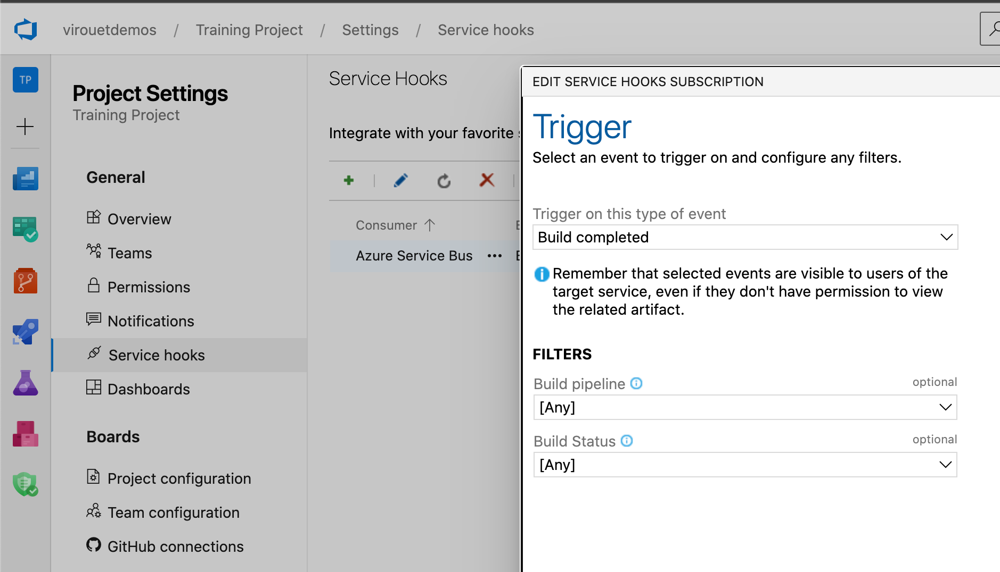

- On the next screen you need to specify a SAS connection string and a queue name. With Service Bus you can either use a queue, a topic or a notification hub. For a storage account, you can only select a queue.

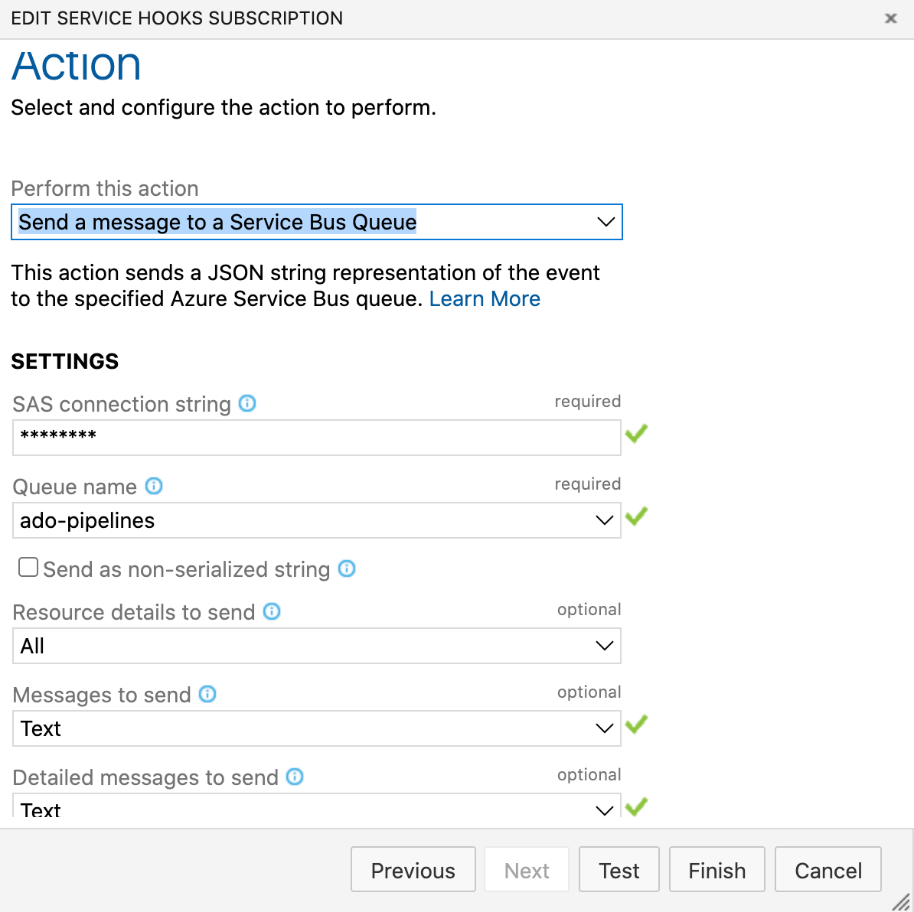

- Click Finish. Now everytime a Pipeline runs, a message will be sent to the service bus queue (or storage queue)

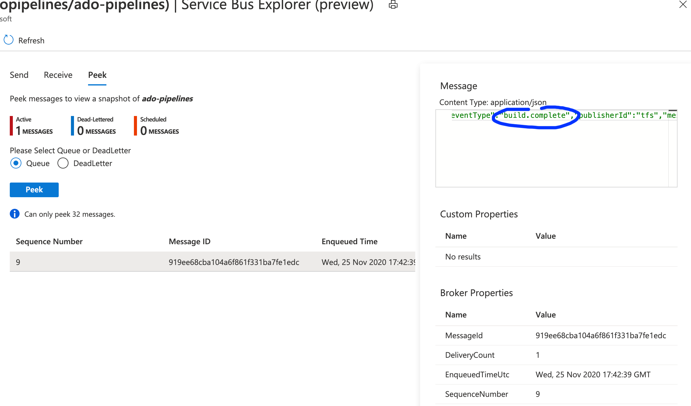

The next step is to  consume the message and act on it. For that, Logic App is very handy!

### configure your Logic App

- Create a Logic App with a service bus trigger (or storage queue) trigger. Connect  to the service bus, select the queue name and the queue type (main as default). Adjust the frequency of the polling frequency

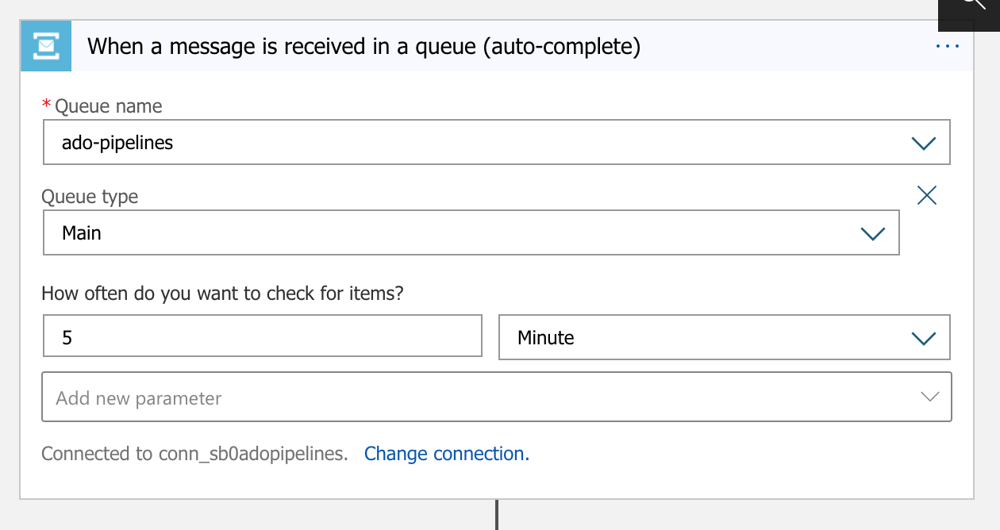

- The message that is delivered is encoded base64 so  you will need an expression in a Compose action to  extract the Json. Use the base64ToString function.
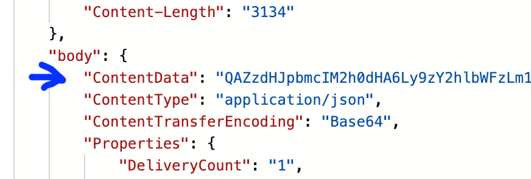


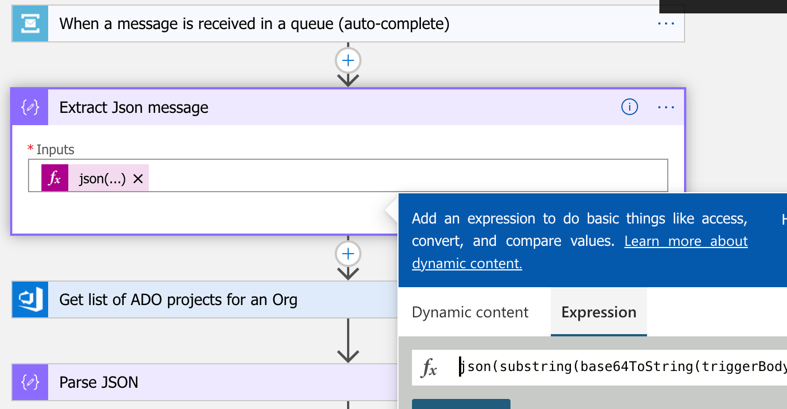

The output  will render the Json content sent by ADO.

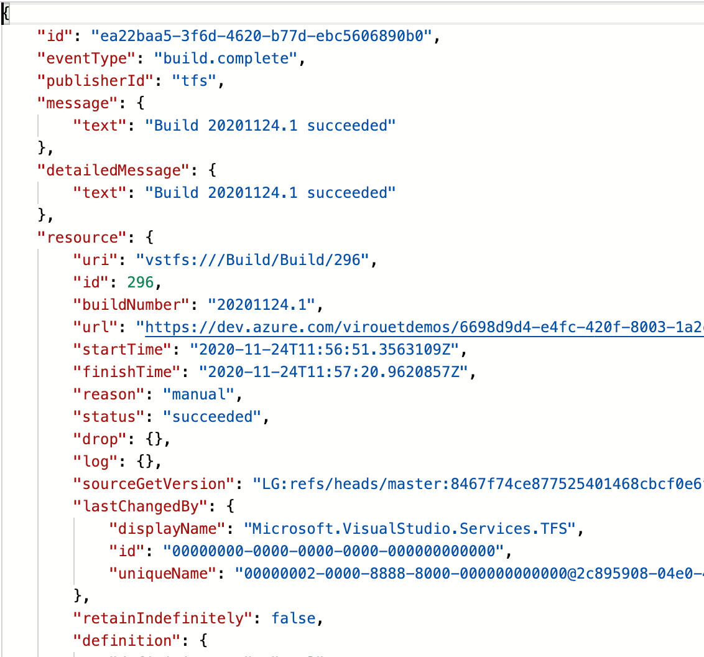

From this point you can take further actions based on your use cases.