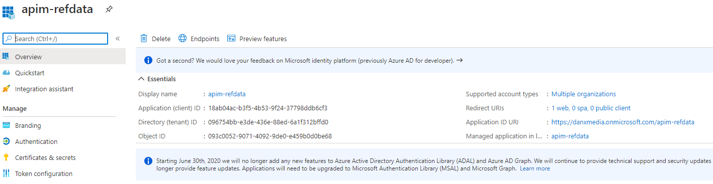
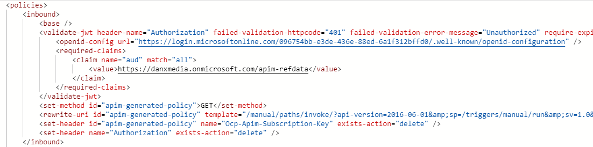
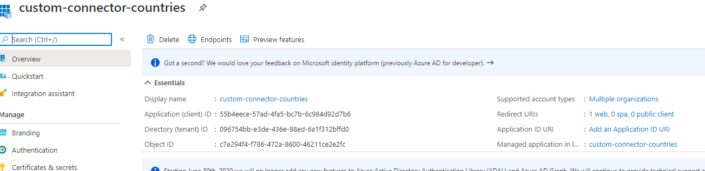
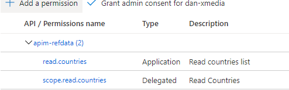
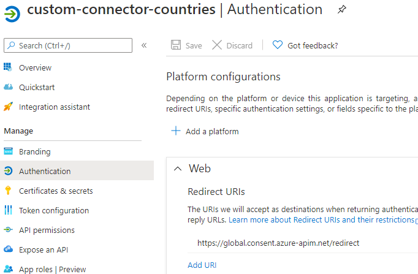
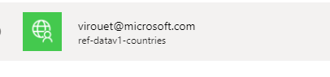

# Expose an API (LogicApps) in APIM and authenticate the APIM with oauth. 
A user can then create an App in PowerApps using the data from the APIs

### Configure the LogicApp. (v1)
Nothing specific. Just create the LogicApp to return a dataset in JSON with a schema.

### Configure APIM

1. Add the LogicApp API to APIM
2. In AAD add a application:
    
    - You can specify a Redirect URL such as :
    ``` 
    https://apim
    ```
    - No Certificates and Secrets
    - In 'Expose an API' set  an Application ID URI such as:
    ```
    https://danxmedia.onmicrosoft.com/apim-refdata
    ```
    - Add a scope with an extra value at the end of the Scope such as: 
     ```
     https://danxmedia.onmicrosoft.com/apim-refdata/scope.read.countries
     ```
    - TODO: complete about how to
    use Roles
3. Back in APIM, select the operation and configure to validate a JWT token in Inbound Policy
    - The url: is always the same but need to specify the tenantID.
    ```
    https://login.microsoftonline.com/096754bb-e3de-436e-88ed-6a1f312bffd0/.well-known/openid-configuration
    ```
    - Add a claim for the audience corresponding to Application ID URI:
    ```
    https://danxmedia.onmicrosoft.com/apim-refdata
    ```
    The audience is the application
    
    - Policy for headers: The Authorization & Ocp-.. Delete are to make sure that for the first the oauth header is not sent to LogicApp and for the second that a key is not required when authenticating

- In AAD create the app reg for the client:

    1. Create a client Secret and copy the secret value
    2. In API Permissions grant access to the apim service app reg scope



### In PowerApps
   1. Create a custom connector using an API Definition file exported from APIM (v2)
   2. In the security part use Oauth2.0 and Identity Provider AAD
   3. Specify the clientID (appId) of the client app reg. As well as the secret
   4. LoginURL is 
   ```
   https://login.microsoftonline.com
   ```
   
   5. Tenant ID (the GUID)
   6. Resource URL is the Application ID URI: 
   ```
   https://danxmedia.onmicrosoft.com/apim-refdata
   ```
   
   7. Scope is the one specified in API Permissions: 
   ```
   https://danxmedia.onmicrosoft.com/apim-refdata/scope.read.countries
   ```
   
   8. Save and Test. It will ask you to create a connector. In this case you will need to authenticate with you user credentials.
   9. Once saved, get the RedirectURL and save it in the Redirect URI of the client app reg in AAD



Now the custom connector exist, new connections can be created and used in Applications in PowerApps.
NOTE: if a user is granted access to the application and try to use it, he/she will be asked to authenticate in order to create a connector with their credentials.
- A connection for virouet



- A connection for Alan

