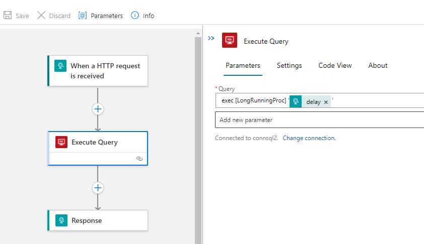
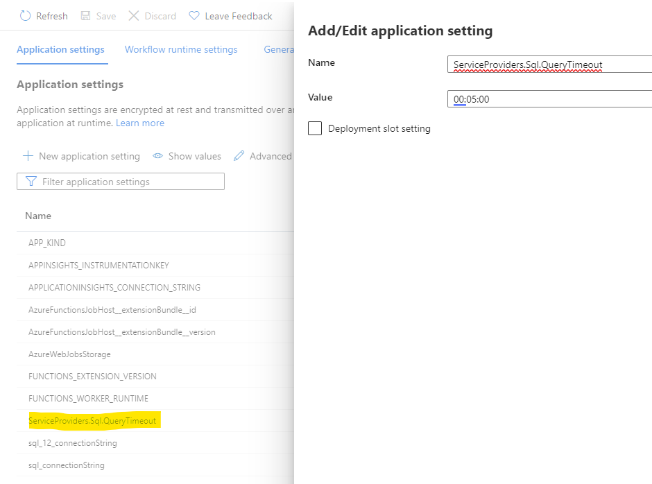

# Logic Apps Integration patterns

## Long running transaction SQL integration
With the Logic Apps SQL Connector (Azure) the time out is set to 1min 50sec. If you are calling a stored procedure or executing a SQL query that will last longer, you will need to consider the following options:

## if using Azure SQL Connector in Logic Apps Standard or Consumption tier
Use the following pattern documented here:  [Handle stored procedure timeouts in the SQL connector for Azure Logic Apps](https://docs.microsoft.com/en-us/azure/logic-apps/handle-long-running-stored-procedures-sql-connector)

## if using Logic Apps built-in SQL Connector.

Set the request timeout value for the execution of the connector [Edit host and app settings for logic apps in single-tenant Azure Logic Apps](https://docs.microsoft.com/en-us/azure/logic-apps/edit-app-settings-host-settings?tabs=visual-studio-code#built-in-sql-operations) 

Step 1: 
Create a workflow and use the Execute Query built-in connector.Input the syntax, here execute a stored procedure and pass a parameter:

Step 2:

In the Azure portal, open your Logic Apps plan and go to Configuration. Under Application Settings, create an entry for "ServiceProviders.Sql.QueryTimeout". Input a value for the timeout in format hh:mm:ss e.g. 00:05:00 for 5 minutes timeout.

