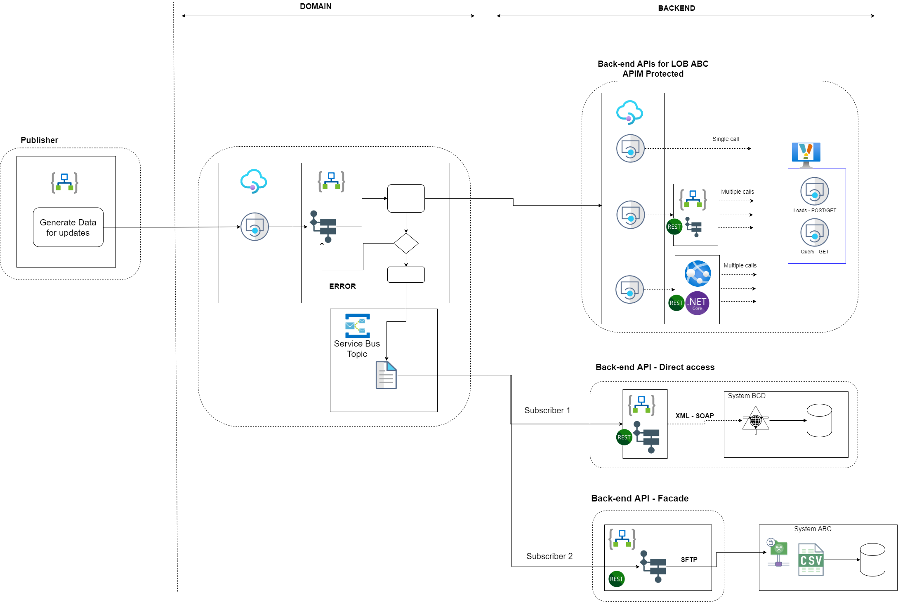

# Demo Publish-Subscribe

Pub-Sub demo with Logic Apps:
- Publish: [logic_v1-emp-master-publish](https://ms.portal.azure.com/#@microsoft.onmicrosoft.com/resource/subscriptions/1d753eb4-5ec5-4e40-a89b-99c7ab6dfc14/resourceGroups/demo-rg-int-emp-dev/providers/Microsoft.Logic/workflows/logic_v1-emp-master-publish)
- Subscribe: [logic_v1-emp-master-system1-subscribe](https://ms.portal.azure.com/#@microsoft.onmicrosoft.com/resource/subscriptions/1d753eb4-5ec5-4e40-a89b-99c7ab6dfc14/resourceGroups/demo-rg-int-emp-dev/providers/Microsoft.Logic/workflows/logic_v1-emp-master-system1-subscribe) and [logic_v1-emp-master-system2-subscribe](https://ms.portal.azure.com/#@microsoft.onmicrosoft.com/resource/subscriptions/1d753eb4-5ec5-4e40-a89b-99c7ab6dfc14/resourceGroups/demo-rg-int-emp-dev/providers/Microsoft.Logic/workflows/logic_v1-emp-master-system2-subscribe)

and service bus
- [sb-contoso1-int-dev](https://ms.portal.azure.com/#@microsoft.onmicrosoft.com/resource/subscriptions/1d753eb4-5ec5-4e40-a89b-99c7ab6dfc14/resourceGroups/demo-rg-int-shared-dev/providers/Microsoft.ServiceBus/namespaces/sb-contoso1-int-dev) (rg [demo-rg-int-shared-dev](https://ms.portal.azure.com/#@microsoft.onmicrosoft.com/resource/subscriptions/1d753eb4-5ec5-4e40-a89b-99c7ab6dfc14/resourceGroups/demo-rg-int-shared-dev))
Logic Apps subscribe to Topic 'master_employee_data'

Subscribe 1=1

